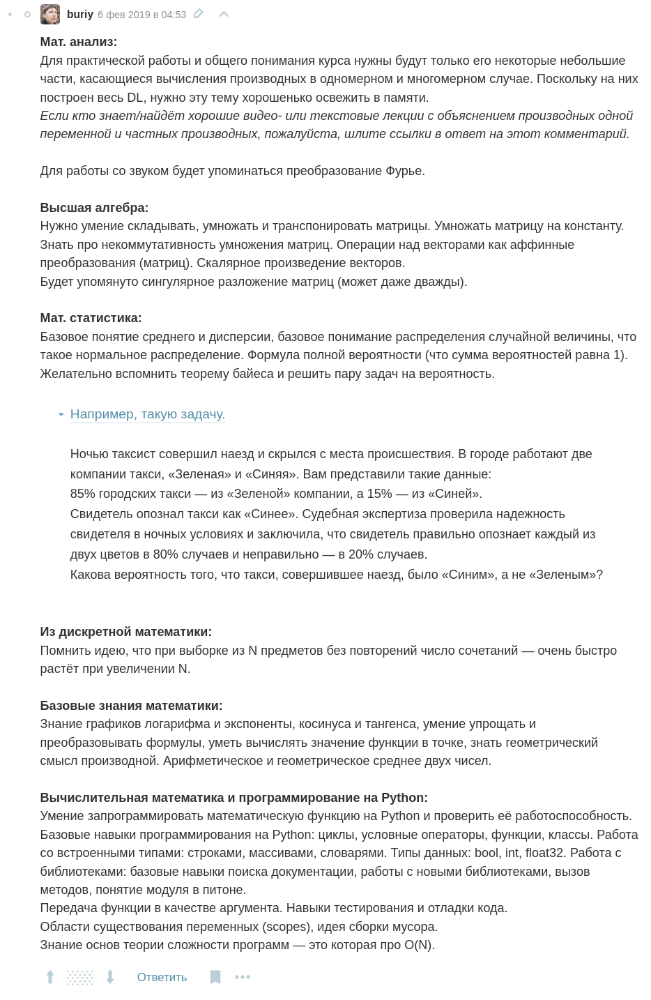

# 🇲🇩️🇲🇩️🇲🇩️

Репозиторий с моими записями по курсу Deep Learning с [dlcourse.ai](https://dlcourse.ai/).

Семинары и задания буду пропускать в угоду семинарам и лабам текущей программы [deep-learning-seminars](https://github.com/bakafox/deep-learning-seminars/).

<h1>Требования к прохождению</h1>

Взято из комментов под статьёй об этом курсе на Хабре:

# Содержание

*честно сгенерировано через чатгпт, соре если он где-то напортачил*

| Лекция (кликабельно!) | Описание (взято с сайта) |
|-----------------|-------------|
| [Л1. Введение](./Л1.%20Введение/_lecture.ipynb) | О чем курс, что такое machine learning и deep learning, основные домены - computer vision, NLP, speech recognition, reinforcement learning. Ресурсы. |
| [Л2. Элементы машинного обучения](./Л2.%20Элементы%20машинного%20обучения/_lecture.ipynb) | Обзор задачи supervised learning. K-nearest neighbor как пример простого алгоритма обучения. Тренировочная и тестовые выборки. Гиперпараметры, их подбор с помощью validation set и cross-validation. Общая последовательность действий при тренировке и валидации моделей (Machine Learning Flow). |
| [Л3. Нейронные сети](./Л3.%20Нейронные%20сети/_lecture.ipynb) | Линейный классификатор - нейронная сеть с одним слоем. Softmax, функция потерь cross-entropy. Тренировка с помощью стохастического градиентного спуска, регуляризация весов. Многослойные нейронные сети, fully-connected layers. Алгоритм backpropagation. |
| [Л4. PyTorch и подробности](./Л4.%20PyTorch%20и%20подробности/_lecture.ipynb) | Backpropagation с матрицами. Введение в PyTorch. Инициализация весов. Улучшенные алгоритмы градиентного спуска (Adam, RMSProp, итд). |
| [Л5. Нейросети на практике](./Л5.%20Нейросети%20на%20практике/_lecture.ipynb) | GPUs. Процесс тренировки и overfitting/underfitting на практике,. Learning rate annealing. Batch Normalization. Ансамбли. Что нового в 2018. |
| [Л6. Convolutional Neural Networks](./Л6.%20Convolutional%20Neural%20Networks/_lecture.ipynb) | Convolution и pooling layers. Эволюция архитектур: LeNet, AlexNet, VGG, ResNet. Transfer learning. Аугментации. |
| [Л7. Segmentation и Object Detection](./Л7.%20Segmentation%20и%20Object%20Detection/_lecture.ipynb) | Более сложные задачи компьютерного зрения - сегментация (segmentation) и нахождение объектов на изображении (object detection). |
| [Л8. Metric Learning, Autoencoders, GANs](./Л8.%20Metric%20Learning,%20Autoencoders,%20GANs/_lecture.ipynb) | Metric Learning на примере распознавания лиц, обзор некоторых методов unsupervised learning в DL. |
| [Л9. Введение в NLP, word2vec](./Л9.%20Введение%20в%20NLP,%20word2vec/_lecture.ipynb) | Краткий обзор области обработки естественного языка и применения deep learning к ней на примере word2vec. |
| [Л10. Recurrent Neural Networks](./Л10.%20Recurrent%20Neural%20Networks/_lecture.ipynb) | Применение рекуррентных нейронных сетей (recurrent neural networks) в задачах распознавания естественного языка. Детали архитектуры LSTM. |
<!--
| [Л11. Аудио и распознавание речи](./Л11.%20Аудио%20и%20распознавание%20речи/_lecture.ipynb) | Применение методов deep learning к задаче распознавания речи. Краткий обзор других задач, связанных с аудио. |
| [Л12. Attention](./Л12.%20Attention/_lecture.ipynb) | Использование механизма Attention в NLP на примере задачи машинного перевода. Архитектура Transformer, современное развитие. |
| [Л13. Reinforcement Learning](./Л13.%20Reinforcement%20Learning/_lecture.ipynb) | Введение в обучение с подкреплением (reinforcement learning), использование методов deep learning. Базовые алгоритмы - Policy Gradients и Q-Learning |
| [Л14. Еще о Reinforcement Learning](./Л14.%20Еще%20о%20Reinforcement%20Learning/_lecture.ipynb) | Model-based RL на примере AlphaZero. Критика и некоторые возможные пути развития области. |
| [Л15. Заключение](./Л15.%20Заключение/_lecture.ipynb) | Итоги. Чем можно заняться после курса, чтобы повысить количество Deep Learning в своей жизни. |
-->
